# Advanced DBMS Assignment
### by: *Lovesh Kumrawat (Roll No: DS7E-2507)*

---

> 1
```sql
SELECT std_name FROM student WHERE marks > 80;
```

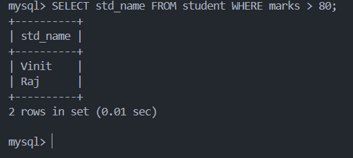

> 2

```sql
SELECT subject, COUNT(*) AS Student_Count FROM student GROUP BY subject;
```

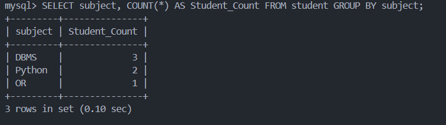

> 3

```sql
SELECT std_name FROM student WHERE subject = 'DBMS';
```

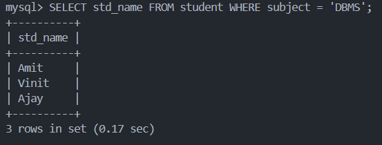

> 4

```sql
SELECT subject, AVG(marks) AS average_marks FROM student GROUP BY subject;
```

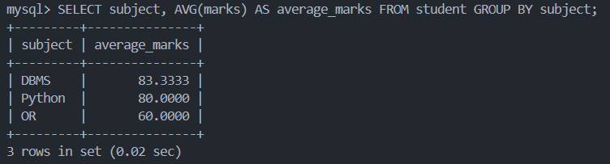

> 5

```sql
SELECT std_name, marks FROM student ORDER BY marks DESC;
```

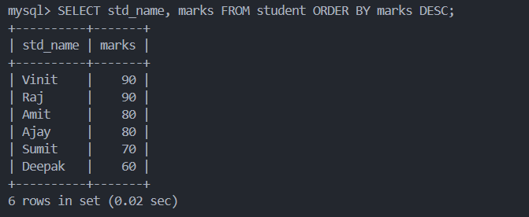

> 6

```sql
SELECT std_name, marks FROM student ORDER BY marks DESC LIMIT 1;
```

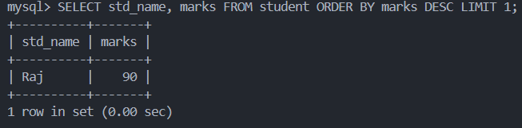

> 7

```sql
SELECT std_name FROM student WHERE marks < (SELECT AVG(marks) FROM student);
```

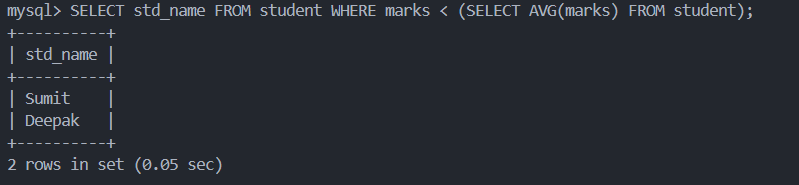

> 8

```sql
SELECT SUM(marks) AS Total_Marks FROM student;
```

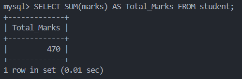

> 9

```sql
SELECT subject, MAX(marks) AS highest_score FROM student GROUP BY subject;
```

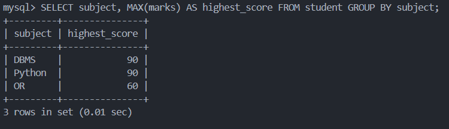

> 10

```sql
SELECT COUNT(*) AS students_below_50 FROM student WHERE marks < 50;
```

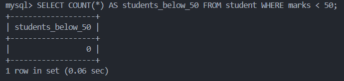

> 11

```sql
SELECT subject, AVG(marks) AS average_marks FROM student GROUP BY subject;
```

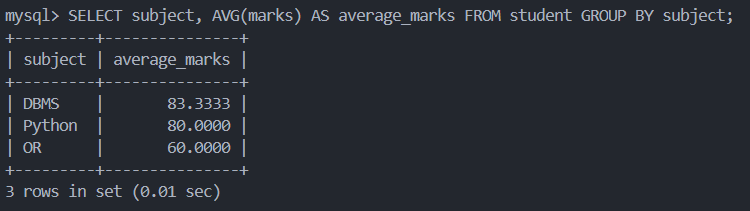

> 12

```sql
SELECT COUNT(DISTINCT subject) AS distinct_courses FROM student;
```

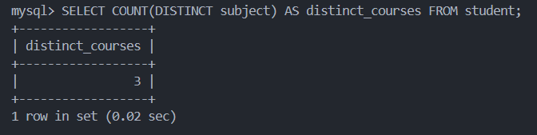

> 13

```sql
SELECT subject, COUNT(*) AS student_count FROM student GROUP BY subject;
```

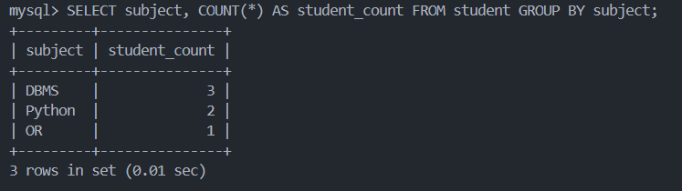

> 14

```sql
SELECT MIN(marks) AS minimum_marks FROM student;
```

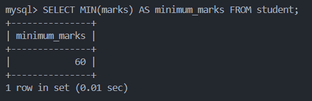

> 15

```sql
SELECT std_name, SUM(marks) AS total_marks FROM student GROUP BY std_name;
```

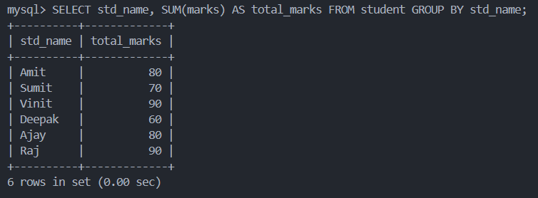

> 16

```sql
SELECT COUNT(*) AS students_above_average FROM student WHERE marks > (SELECT AVG(marks) FROM student);
```

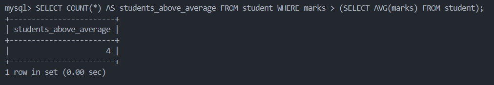

> 17

```sql
SELECT subject FROM student GROUP BY subject ORDER BY AVG(marks) DESC LIMIT 1;
```

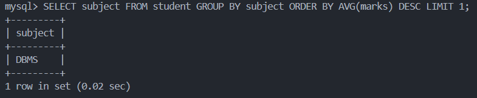

> 18

```sql
SELECT std_name, marks, (marks / 100.0) * 100 AS percentage FROM student;
```

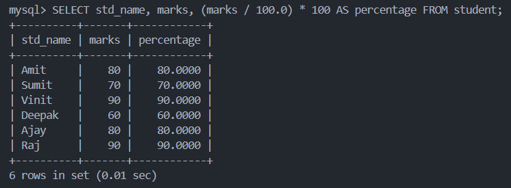

> 19

```sql
SELECT std_name, ROUND(marks) AS rounded_marks FROM student;
```

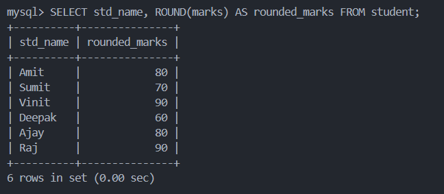

> 20

```sql
SELECT MAX(marks) - MIN(marks) AS Marks_Difference FROM student;
```

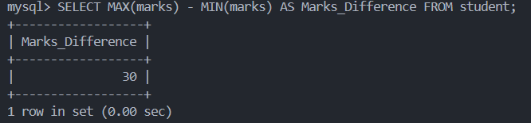

> 21

```sql
SELECT std_name, marks FROM student WHERE marks > (SELECT AVG(marks) * 1.10 FROM student);
```

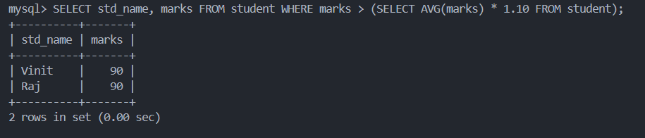

> 22

```sql
SELECT std_name, marks, POWER(marks, 2) AS marks_squared FROM student;
```

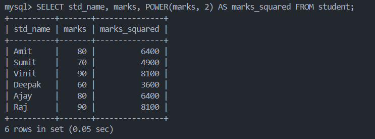

> 23

```sql
SELECT ROUND(AVG(marks), 2) AS average_marks FROM student;
```

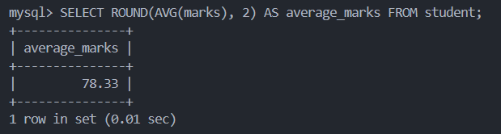

> 24

```sql
SELECT std_name, marks, (marks / (SELECT SUM(marks) FROM student) * 100) AS percentage_contribution FROM student;
```

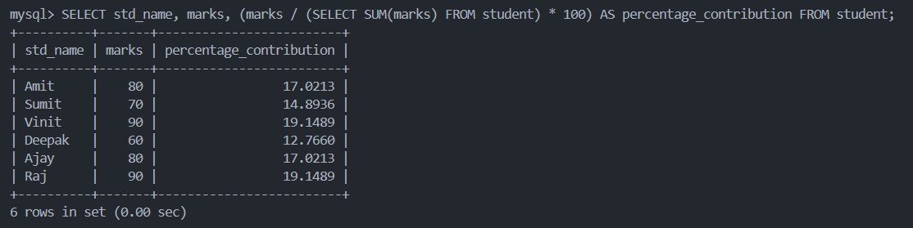

> 25

```sql
SELECT std_name, marks, ABS(marks - (SELECT AVG(marks) FROM student)) AS marks_difference FROM student;
```

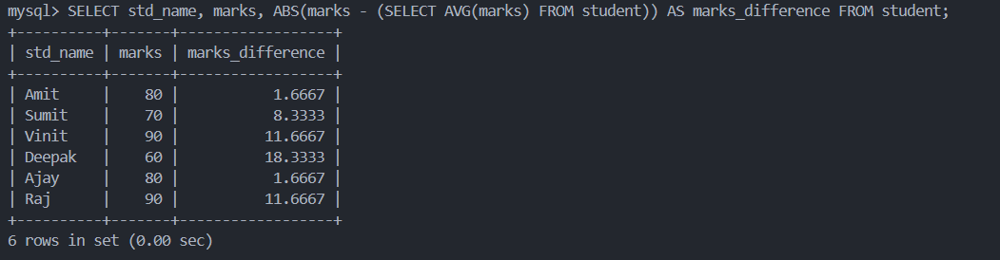

> 26

```sql
SELECT std_name, marks, RANK() OVER (ORDER BY marks DESC) AS std_rank FROM student;
```

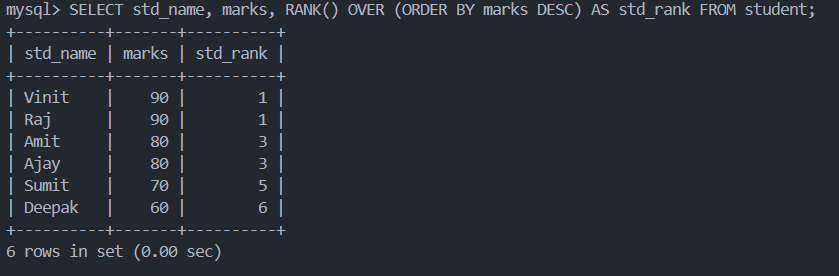

> 27

```sql
SELECT COUNT(*) AS total_students FROM student;
```

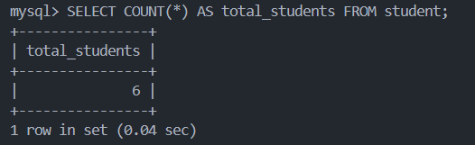

> 28

```sql
SELECT std_name, LENGTH(std_name) AS first_name_length FROM student;
```

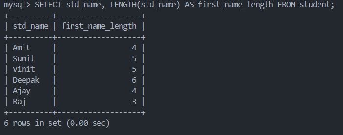

> 29

```sql
SELECT UPPER(std_name) AS uppercase_name FROM student;
```

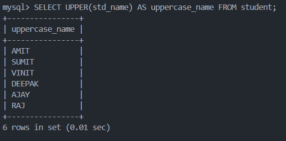

> 30

```sql
SELECT LOWER(std_name) AS lowercase_student_name FROM student;
```

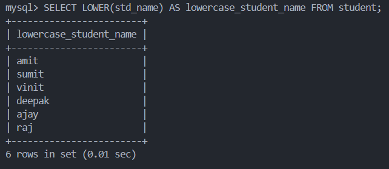

> 31

```sql
SELECT std_name, SUBSTRING(std_name, 1, 2) AS first_two_letters FROM student;
```

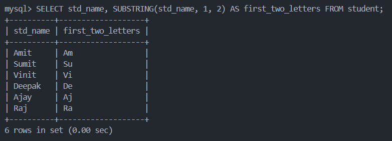

> 32

```sql
SELECT * FROM student WHERE std_name LIKE 'S%';
```

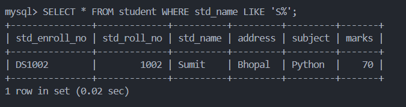

> 33

```sql
SELECT * FROM student WHERE LENGTH(std_name) > 3;
```

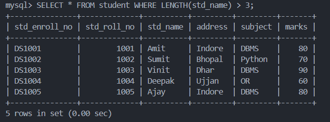

> 34

```sql
SELECT std_name, REPLACE(std_name, 'o', '0') AS modified_last_name FROM student;
```

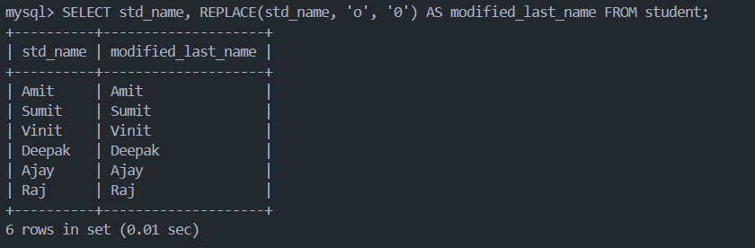

> 35

```sql
ALTER TABLE student ADD email VARCHAR(100);
```

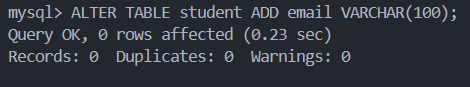

> 36

```sql
ALTER TABLE student RENAME COLUMN std_name TO std_first_name;
```

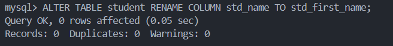

> 37

```sql
ALTER TABLE student DROP COLUMN subject;
```

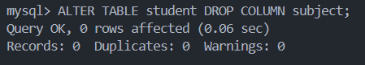

> 38

```sql
ALTER TABLE student ADD PRIMARY KEY (std_enroll_no);
```

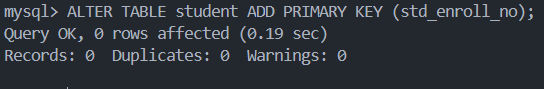

> 39

```sql
ALTER TABLE student ADD CONSTRAINT unique_email UNIQUE (email);
```

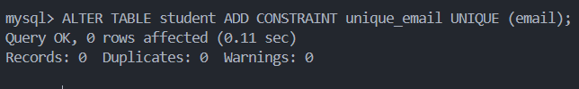

> 40

```sql
UPDATE student SET marks = marks + 5;
```

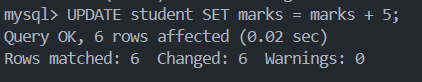

> 41

```sql
UPDATE student SET std_first_name = 'Amit Kumar' WHERE std_enroll_no = 'DS1001';
```

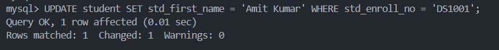

> 42

```sql
UPDATE student SET marks = 80 WHERE marks IS NULL;
```

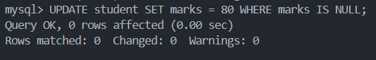

> 43

```sql
DELETE FROM student WHERE std_first_name = 'Amit Kumar';
```

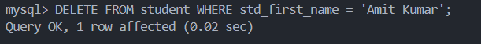

> 44

```sql
DELETE FROM student WHERE std_first_name LIKE 'A%';
```

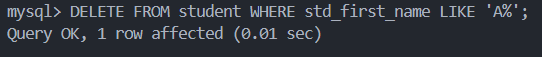

> 45

```sql
DELETE FROM student WHERE marks < 75;
```

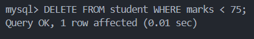

> 46

```sql
DELETE FROM student;
```

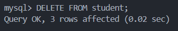

> 47

```sql
SELECT * FROM student;
```

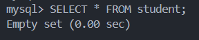

> 48

```sql
SELECT first_name, last_name FROM student;
```

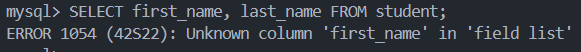

> 49

```sql
SELECT * FROM student WHERE marks = 90;
```

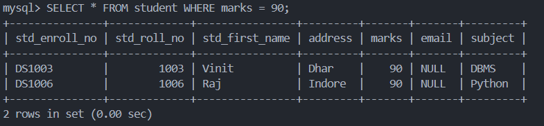

> 50

```sql
SELECT * FROM student WHERE marks > 80;
```

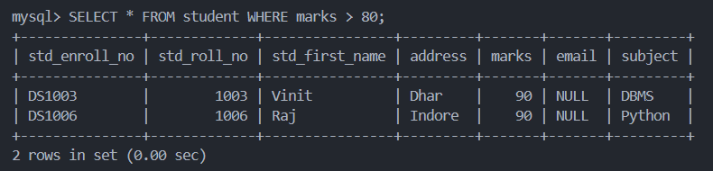

> 51

```sql
SELECT * FROM student WHERE std_first_name = 'Raj';
```


> 52

```sql
SELECT * FROM student ORDER BY marks DESC;
```


> 53

```sql
SELECT COUNT(*) AS total_students FROM student;
```


> 54

```sql
SELECT marks, COUNT(*) AS Total_Student FROM student GROUP BY marks;
```


> 55

```sql
SELECT DISTINCT marks FROM student;
```


> 56

```sql
SELECT * FROM student WHERE std_first_name LIKE 'A%';
```


> 57

```sql
SELECT * FROM student WHERE marks > (SELECT AVG(marks) FROM student);
```


---
